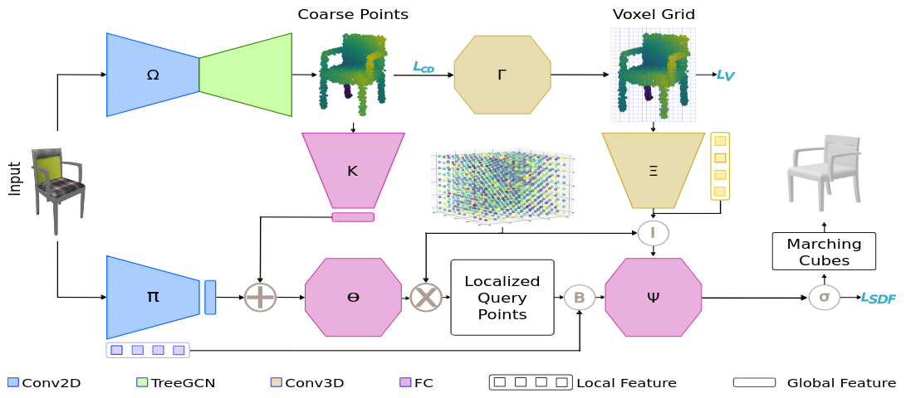

## LIST: Learning Implicitly from Spatial Transformers for Single-View 3D Reconstruction 

### Overview

Accurate reconstruction of both the geometric and topological details of a 3D
object from a single 2D image is a fundamental challenge in computer vision.
Multi-view 3D reconstruction formulations allow for integrating information
from numerous images to compensate for occluded geometry. However,
reconstructing a 3D object from a single image is a more difficult task since a
sole image does not contain the whole topology of the target shape due to
self-occlusions.

<p align="center">

</p>

This repository provides source code for our 2023 ICCV paper titled "[LIST:
Learning Implicitly from Spatial Transformers for Single-View 3D
Reconstruction](https://arxiv.org/pdf/2307.12194.pdf)." LIST is a deep learning
framework that can reliably reconstruct the topological and geometric structure
of a 3D object from a single RGB image. Our model does not depend on weak
perspective projection, nor does it require any camera parameters during
training or inference. Moreover, we leverage both local and global image
features to generate highly-accurate topological and geometric details.

### Citation

If you find this project useful, then please consider citing our work.

```bibitex
@inproceedings{arshad2023list,
  title={LIST: Learning Implicitly from Spatial Transformers for Single-View 3D Reconstruction},
  author={Arshad, Mohammad Samiul and Beksi, William J},
  booktitle={Proceedings of the IEEE/CVF International Conference on Computer Vision (ICCV)},
  pages={},
  year={2023}
}
```

### Model Architecture

<p align="center">

</p>

### Installation

First, clone and navigate to the project

    $ git clone https://github.com/robotic-vision-lab/Learning-Implicitly-From-Spatial-Transformers-Network 
    $ cd Learning-Implicitly-From-Spatial-Transformers-Network 

Next, download and install any necessary libraries. 

### Data Processing

We conducted experiments on the following datasets: ShapeNet and Pix3D. To run
these experiments, please download the ShapeNet dataset
[renderings](https://github.com/Xharlie/ShapenetRender_more_variation) and the
ground-truth dataset of
[isosurfaces](https://drive.google.com/drive/folders/1QGhDW335L7ra31uw5U-0V7hB-viA0JXr)
processed by the authors of
[DISN](https://github.com/laughtervv/DISN/tree/master).

Then, create the directory `./Datasets/shapenet/images/` and place the renderings in this
directory. Similarly, create and move the isosurfaces into `./Datasets/shapenet/DISN/`.

The training data can be preprocessed by invoking

    $ python3 preprocessing/preprocess.py

Sampling the farthest point clouds is done by running

    $ python3 preprocessing/farthest_pointcloud.py

Please follow the same procedure for [Pix3D](https://github.com/xingyuansun/pix3d) as well.

## Usage

#### Model Training

We employ two-stage training for LIST as follows. First, we train a smaller model to predict the coarse shape from the image

    $ nohup python3 -u train.py --model network.models.CoarseNet --dataset datasets.Datasets.IM2PointFarthest --exp_name coarse_prediciton --train_batch_size 16 --eval_pred --plot_every_batch 50 --save_after_epoch 10 --test_every_epoch 10 --save_every_epoch 10 --coarse_point_density 4096 --color_jitter --normalize > output.log &

This will save a single checkpoint for each epoch. To use the pretrained model, we need to separate the encoder/decoder checkpoints. To do this, enter the following commands in the terminal:

```
import arguments
from network.models import CoarseNet

config = arguments.get_args()
model = CoarseNet(config)
coarse_ckpt = torch.load('./results/coarse_prediciton/checkpoints/best_model_test.pt.tar')
model.load_state_dict(coarse_ckpt['state_dict'])
torch.save({'epoch': coarse_ckpt['epoch'], 'state_dict': model.image_encoder.state_dict(
)}, './results/coarse_prediciton/checkpoints/best_IME_test.pt.tar')
torch.save({'epoch': ch['epoch'], 'state_dict': model.point_decoder.state_dict(
)}, './results/coarse_prediciton/checkpoints/best_PD_test.pt.tar')
```

Then, LIST can be fully trained via the following command 

    $ nohup python3 -u train.py --model network.models.LIST --dataset datasets.Datasets.IM2SDF --exp_name LIST --train_batch_size 8 --plot_every_batch 50 --save_after_epoch 10 --test_every_epoch 1 --save_every_epoch 1 --eval_pred --coarse_point_density 4096 --sample_distribution 0.45 0.44 0.1 --color_jitter --normalize --sdf_scale 10.0 --warm_start > ./results/LIST/output.log &

#### Model Inference

Please run the following command to test LIST

    $ nohup python3 -u test.py --model network.models.LIST --dataset datasets.Datasets.IM2SDF --exp_name LIST --eval_pred --coarse_point_density 4096 --sample_distribution 0.45 0.44 0.1 --color_jitter --normalize --sdf_scale 10.0 --test_gpu_id 0 > ./results/LIST/output.log &

### License

[](https://github.com/robotic-vision-lab/Learning-Implicitly-From-Spatial-Transformers-Network/blob/main/LICENSE)
